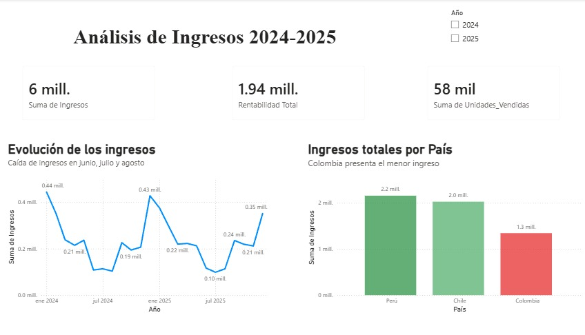
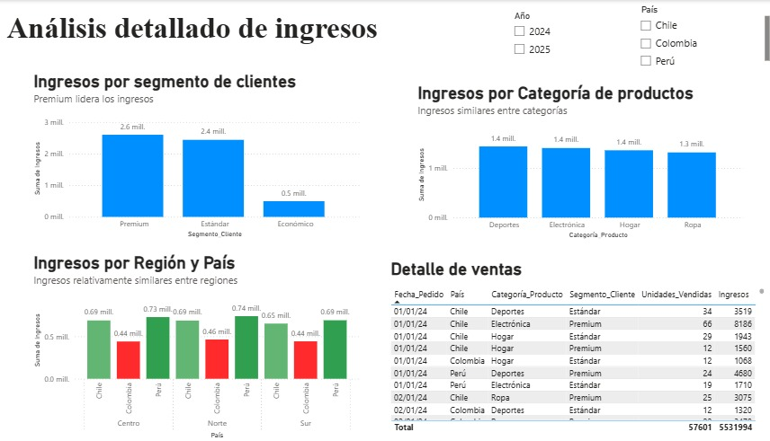

# Grupo Andes Retail – Análisis de Ventas por Segmento y Región
Análisis de ventas de Grupo Andes Retail enfocado en identificar el comportamiento comercial según segmento de cliente, categoría de producto y país, mediante dashboards interactivos en Power BI.

## Pregunta de negocio
¿Cómo se comportan las ventas según el segmento de cliente, categoría de producto y país, y qué diferencias pueden identificarse entre los distintos mercados?

## Objetivo
- Analizar el desempeño de las ventas por segmento de cliente.
- Identificar las categorías con mayor y menor desempeño.
- Comparar el comportamiento de las ventas entre países.
- Analizar la evolución mensual de las ventas.
- Presentar los resultados mediante dashboards interactivos en Power BI.

## Datos
El análisis utiliza información comercial de Grupo Andes Retail, considerando variables relacionadas con:
- Segmento de cliente.
- Categoría de producto.
- País.
- Ventas por periodo.

## Metodología
- Organización y revisión de la información disponible.
- Análisis de ventas por segmento de cliente.
- Comparación del desempeño por categoría.
- Comparación de resultados entre países.
- Análisis de la evolución mensual de las ventas.
- Construcción de dashboards interactivos en Power BI.

## Herramientas
- Power BI

## Dashboards
### Resumen Ejecutivo
Vista general del desempeño de las ventas, con indicadores y visualizaciones para identificar diferencias entre segmentos, categorías y países.

### Análisis Detallado
Permite profundizar en el comportamiento de las ventas mediante el análisis por segmento de cliente, categoría, país y periodo.

## Principales hallazgos
- El segmento **Premium** presentó el mayor desempeño en ventas, mientras que **Económico** registró el menor.
- La categoría **Deportes** destacó como la de mayor desempeño.
- **Perú** presentó el mayor nivel de ventas entre los países analizados, mientras que **Colombia** registró el menor.
- En **2024**, julio presentó un nivel de ventas ligeramente superior al de junio y agosto.
- En **2025**, julio presentó un nivel de ventas inferior al registrado en junio y agosto.

## Archivos del proyecto
- Archivo de Power BI (`.pbix`) — dashboard y análisis del proyecto.
- `andes_resumen_ejecutivo.png` — captura del dashboard Resumen Ejecutivo.
- `andes_analisis_detallado.png` — captura del dashboard Análisis Detallado.
